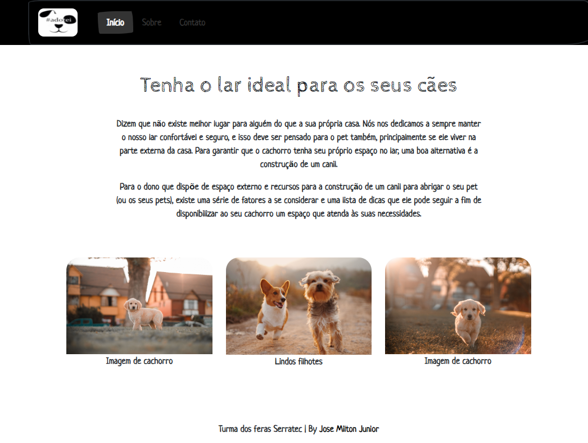

# Hashtagadotei

Projeto criado durante a avaliação final do módulo de FrontEnd Essencial da residencia de software do Serratec.

[Cliquei aqui para acessar](https://hashtagadotei.netlify.app/)

## 🛠️ Tecnologias

- HTML
- CSS
- Bootstrap
- Git e Github

## 🚀 O que aprendi
- Aprendi sobre o conceito de CSS Flexbox e responsividade.

## 🖤 Contato

jmjuniormonteiro@gmail.com

https://www.linkedin.com/in/jmjuniordeveloper/

https://www.instagram.com/jmjuniordeveloper/